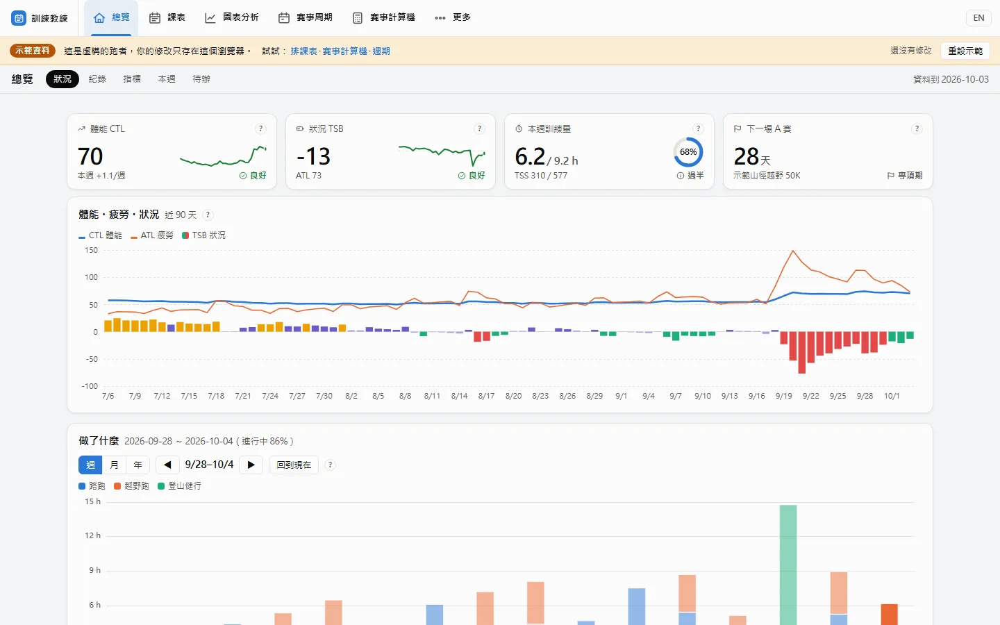
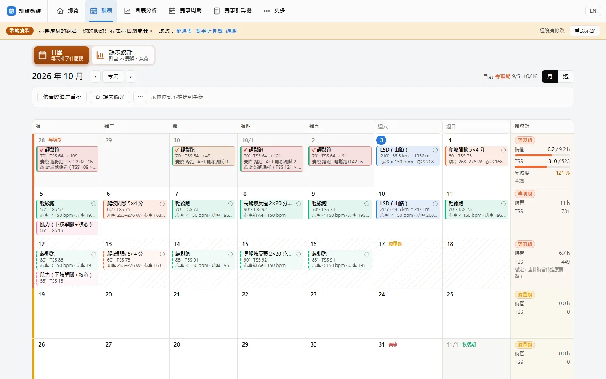
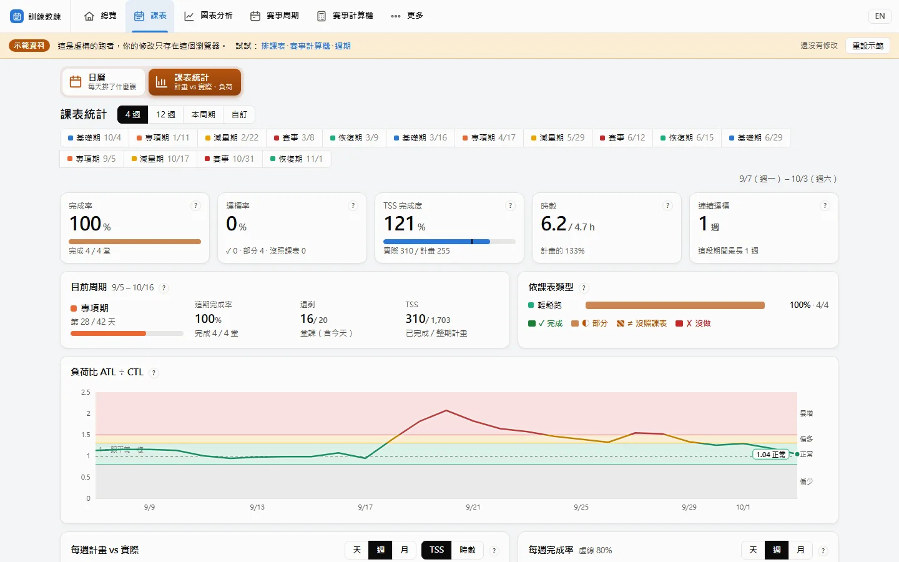
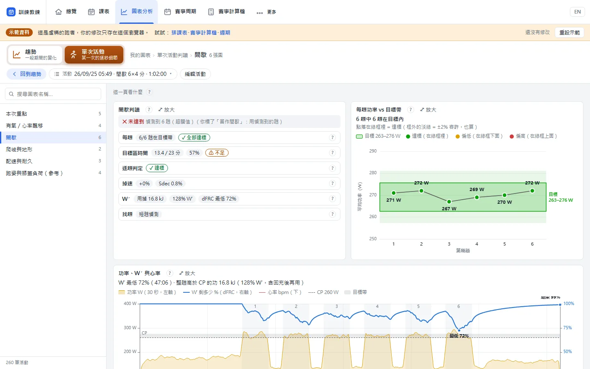
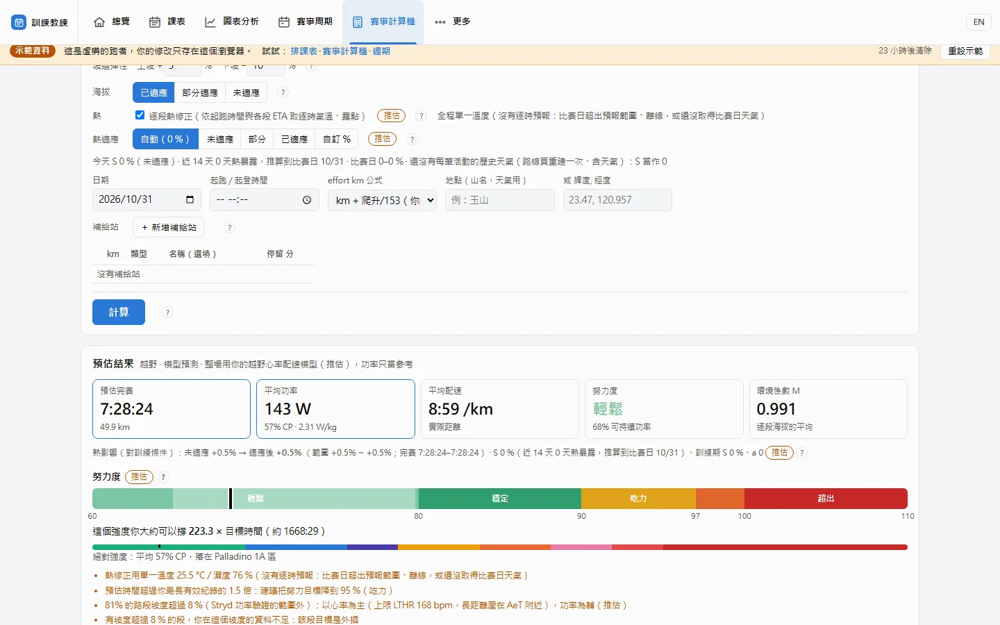
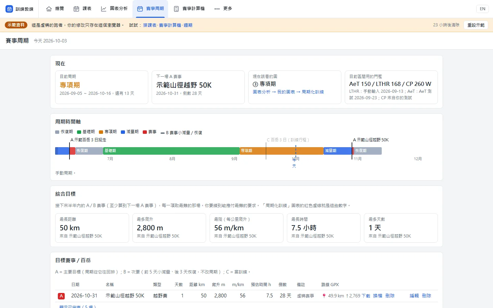
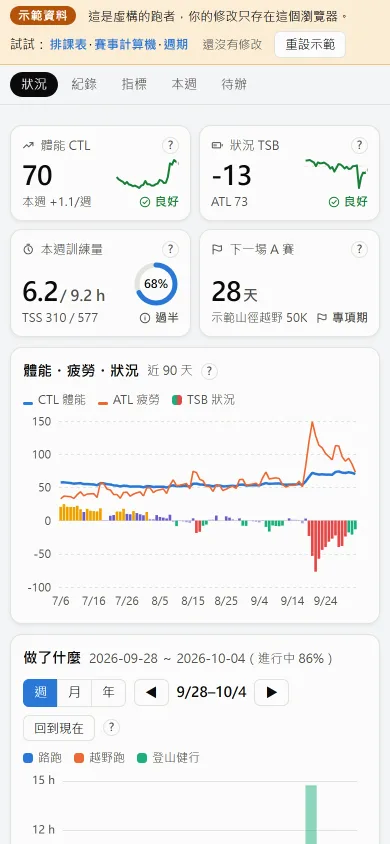

# TrailRunCoach

**給越野跑、百岳、路跑的訓練教練。** 讀你的手錶資料，告訴你現在的訓練狀況、幫你排課表並推送到 COROS 手錶、
判讀每一趟間歇和心率飄移，還能用賽道 GPX 預估比賽配速、功率和補給。自己架、資料留在自己的電腦。

> **線上示範**：<https://vi000246.github.io/TrailRunCoach/> — 一位虛構跑者的一年資料，不用登入就能看訓練總覽、圖表、
> 賽事計算機和週期規劃，課表可以試著改（修改只存在你的瀏覽器）。唯讀的靜態網站，沒有伺服器。



## 適合誰

- **越野跑者**：爬升、技術下坡、長距離；功率（Stryd）或只有心率都可以。
- **百岳／多日縱走**：背重、高海拔、連續多天的體能與配速估算。
- **路跑**：半馬、全馬的週期、配速和負荷管理。

## 主要功能

| | |
|---|---|
| **總覽 dashboard** | 體能／疲勞／狀態（PMC）、負荷比、近期最佳、狀況卡，一頁看完。 |
| **自動排課＋推送 COROS** | 依週期、課表偏好、休息日自動排一週，拖曳調整，一鍵推送到手錶。 |
| **間歇／飄移判讀** | 每趟間歇的功率對目標、心率飄移（白話說明），AeT／CP 測試自動辨識。 |
| **賽事計算機** | 賽道 GPX＋天氣＋你的體能 → 分段配速、目標功率、完賽時間、補給；可匯出 COROS 課表。 |
| **週期規劃** | A／B／C 賽事，基礎／強化／專項／減量期，課表跟著週期走。 |
| **課表統計** | 達成率、各種課的比例、各階段的負荷比。 |
| **傷病紀錄** | 疼痛標記、受傷事件與回歸建議（只在自己的電腦，不分享）。 |

<table>
<tr><td></td><td></td></tr>
<tr><td></td><td></td></tr>
<tr><td></td><td align="center"></td></tr>
</table>

截圖全部來自示範模式的虛構跑者。

## 資料來源

- **COROS**：帳號登入後同步活動（FIT），也能把課表推送到手錶。
- **TrainingPeaks**：網站登入或你自己的 OAuth client（`TP_CLIENT_ID`／`TP_CLIENT_SECRET`）。
- **FIT 檔**：任何手錶匯出的 FIT。

## 隱私

資料（活動、心率、門檻、帳號 token）只存在你自己的電腦：`~/.wko5coach/`（SQLite、快取、加密金鑰）。
token 和記住的密碼以 Fernet 加密。沒有雲端、沒有追蹤。線上示範只有虛構資料，訪客的修改只存在自己的瀏覽器。

## 在自己的電腦上跑

需要 Python 3.12。

```bash
python -m venv .venv
.venv/bin/pip install -r requirements.txt          # Windows: .venv\Scripts\pip
.venv/bin/python -m uvicorn backend.main:app --port 8000
```

打開 <http://localhost:8000>，到「設定 → 資料同步」登入 COROS 或 TrainingPeaks。
所有環境變數見 [`.env.example`](.env.example)，都是選填。

### Docker

```bash
docker compose up --build        # 掛載 ~/.wko5coach
```

### 示範模式（虛構跑者）

```bash
python -m backend.demo.build --root ~/trc-demo                    # 產生示範資料（約一年、幾分鐘）
WKO5COACH_MODE=demo WKO5COACH_HOME=~/trc-demo WKO5COACH_COOKIE_SECURE=0 \
  python -m uvicorn backend.main:app --port 8001
```

示範模式有自己的資料夾（拒絕使用 `~/.wko5coach`），同步、上傳、AI、分享都關閉；每位訪客第一次修改時
才建立自己的沙盒，24 小時後清除。

**公開示範預設是靜態網站**（免費放在 GitHub Pages，不需要伺服器）：

```bash
pip install -r requirements-dev.txt && python -m playwright install chromium
python -m backend.demo.export_static --root ~/trc-demo        # → dist/static-demo/
```

匯出時在程式內跑示範模式、用無頭瀏覽器點過每一頁，把每個 API 回應存成 JSON；頁面裡的小 shim 把請求對到
這些檔案。課表的修改存在訪客的瀏覽器（localStorage），其他寫入一律顯示「唯讀示範」。發佈步驟見
[`deploy/static/`](deploy/static/README.md)。

**伺服器版示範（Docker）** 仍然保留：同一個示範模式（`WKO5COACH_MODE=demo`，每位訪客一個沙盒，可以改週期規劃、
上傳 GPX）打包成 Docker image（[`deploy/hf/Dockerfile`](deploy/hf/Dockerfile)），可以放在任何能跑 Docker 的雲端主機；
Hugging Face Docker Space（現在要付費）是其中一種，見 [`deploy/hf/`](deploy/hf/README.md)
（`python deploy/hf/make_space.py <space-repo>`）。兩條路互不影響：靜態網站是免費的預設，Docker 是要雲端部署時用。

## 測試

```bash
pip install -r requirements-dev.txt
python -m pytest backend/tests -q -m "not golden"
```

預設只用合成資料，不碰 `~/.wko5coach`。

---

## English summary

TrailRunCoach is a self-hosted training coach for trail runners, mountain hikers (Taiwan's 百岳)
and road runners. It reads your watch data (COROS, TrainingPeaks or plain FIT files) and gives you
an overview dashboard (PMC, load ratio, status), an automatic weekly schedule you can push to a
COROS watch, interval and heart-rate-drift analysis per activity, a race calculator (GPX + weather +
fitness → pacing, power, finish time, fuelling), season periodisation, schedule statistics and an
injury log. Your data stays on your machine. The public demo (a synthetic athlete) is a static,
read-only export hosted on GitHub Pages: <https://vi000246.github.io/TrailRunCoach/>
(`python -m backend.demo.export_static`, see `deploy/static/`); schedule edits are kept in the
visitor's browser. The server-side demo (`WKO5COACH_MODE=demo`, per-visitor sandboxes) stays
available as a Docker image (`deploy/hf/Dockerfile`) for any Docker host, e.g. a (paid) Hugging Face
Docker Space (`deploy/hf/`). The UI is Traditional Chinese first, with an
English catalog.

> Not affiliated with COROS, TrainingPeaks or Stryd.

## License

[MIT](LICENSE). Third-party data: GoldenCheetah OpenData and the Lovdal dataset used by the
validation scripts are CC0; they are fetched or placed outside the repo, not bundled.
